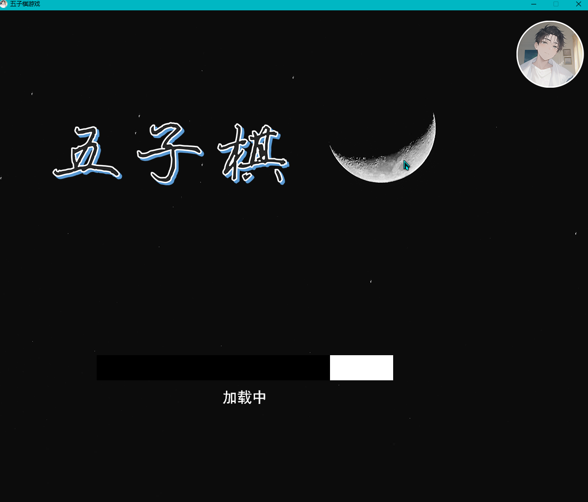
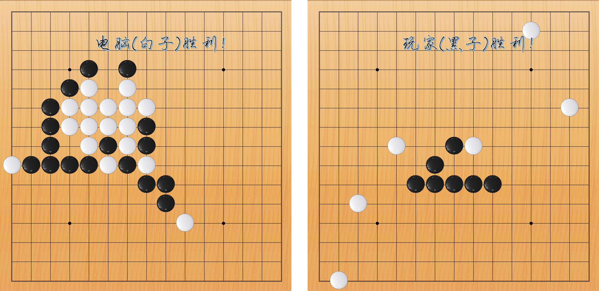
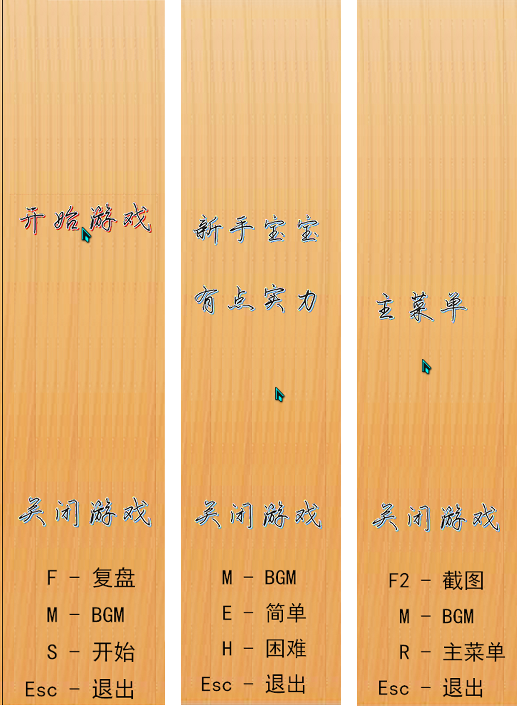
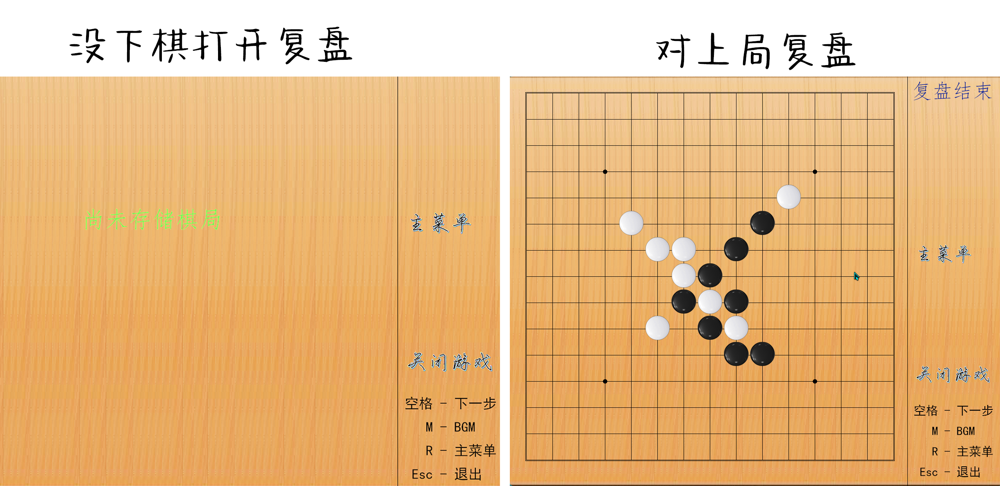

# Gobang-Easy

## 一个超简单的五子棋游戏

 
<b>加载动画</b>

 

 
<b>棋盘 以及 游戏内置截图</b>

 

 
<b>右侧菜单</b>

 

 
<b>复盘功能</b>

 

## 说明

本程序所使用的图形库非官方的   `easyx`   ，而是   `easyx-for-mingw`   这是因为部分原因采用的是  `MinGW`   的编译器( 建议采用   `TDM-GCC`   版本衍生自   `MinGW-w64`   ，对   `easyx-for-mingw`   兼容性较好 )。如果你们想沿用我这套，可以参考 [VScode+MinGW系列编译器配置easyx](https://blog.csdn.net/qq_63481422/article/details/125936400?ops_request_misc=&request_id=&biz_id=102&utm_term=MinGW%E4%B8%8EeasyX&utm_medium=distribute.pc_search_result.none-task-blog-2~all~sobaiduweb~default-0-125936400.142^v68^control,201^v4^add_ask,213^v2^t3_esquery_v1&spm=1018.2226.3001.4187) 或者 [在 CLion、Dev-C++ 或 Code::Blocks 下面配置 EasyX](https://codebus.cn/bestans/easyx-for-mingw) 这两篇文章。

## 有问题？

-   你可以在上方找到 `issue` ，在那里向我反馈
-   或者加我的 QQ : [2982388220](tencent://AddContact/?fromId=45&fromSubId=1&subcmd=all&uin=2982388220&website=www.oicqzone.com) ( 如果跳转失败: 请检查链接中tencent后是否有英文冒号，如果没有请自行添加。或者自行搜索我 )
